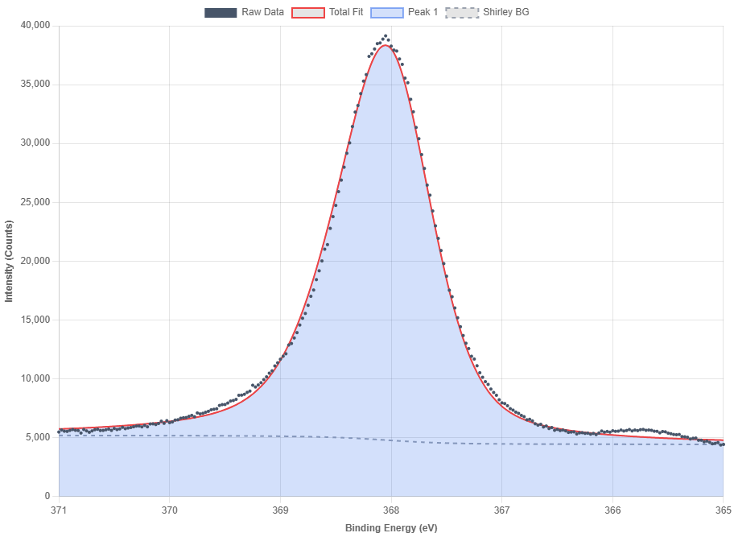

# XPS Peak Fitting Simulator

An area-based XPS peak fitting simulator supporting Shirley background and asymmetry adjustments, directly runnable in the browser.

## Features
* **Area-Based Fitting**: Smoothly adjust peak position, area, FWHM, and Gaussian/Lorentzian mix ratios.
* **Asymmetry Support**: Includes tailing factors ($\alpha$) for asymmetric peak lineshapes.
* **Shirley Background**: Interactive Shirley background alignment with step ratio and offset tuning.
* **Data & Screenshot Export**: Save your fitting components as text files or capture the chart directly as a PNG image.

## Preview

## Live Demo
You can try the live simulator here:
[https://shige2k.github.io/xps-peak-fitting-simulator/](https://ユーザー名.github.io/xps-peak-fitting-simulator/)
